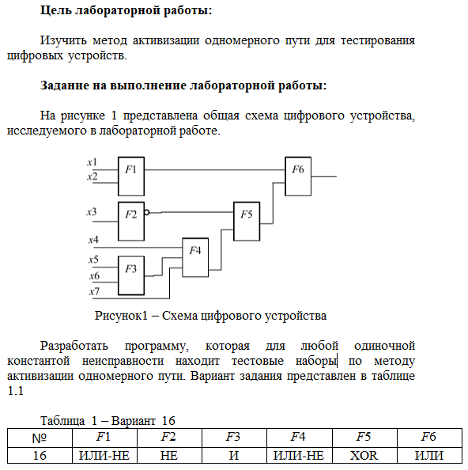
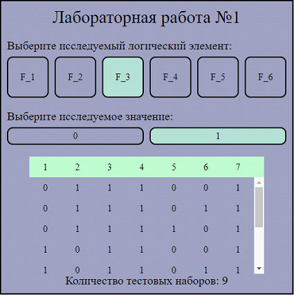
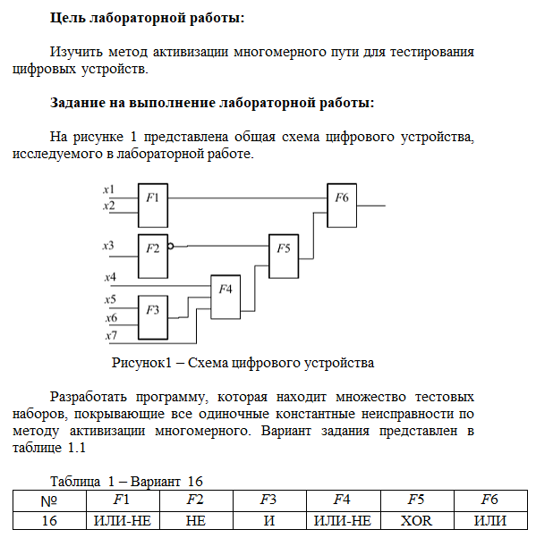
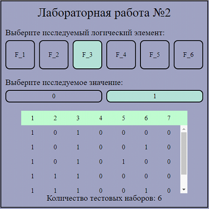
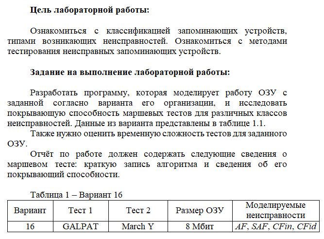
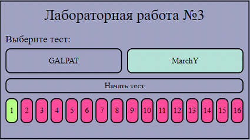
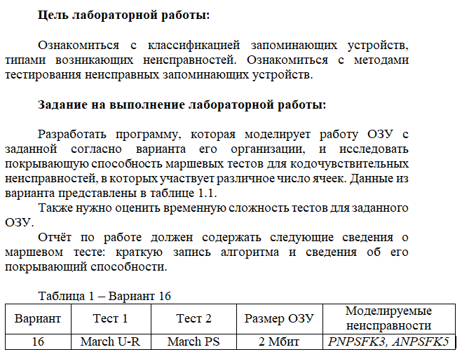
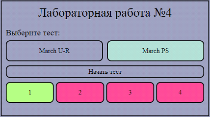
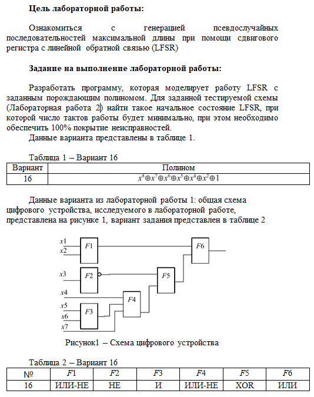
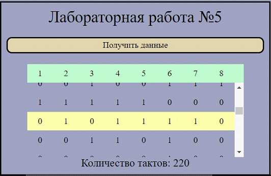

# laboratory-work-on-hardware-testing

В 1 и 2 лабораторной работе рассматривается готовая логическая схема, которая уже была собрана (спаяна). Нужно при помощи двух рассмотренный алгоритмов (каждый из них рассматривается в своей лабораторной) для каждого элемента (узла) и для каждого возможного значения получить тестоные наботы входных сигналов.

Под тестовыми наборами сигналов подразумевается таблица значений сигналов, которые нужно подать на входы схемы и соответствующий им результат на выходе, которые в реальной схеме показывали бы, что конкреный узел схемы неисправен (для которого формируются тестовые наборы).

Более понятно можно описать как починку некой модульной системы. У вас есть готовая схема, вы её тестируете, находите неисправный модуль по результатам тестирования и его заменяете. 1 и 2 лабораторные генерируют сами тесты.

Схема, представленная на скриншотах условий, реализована ввиде констант.

В лабораторных работах 3 и 4 происходит генерания рабочей(либо первая, либо ниодной)/испорченных готовых плат оперативной памяти с разными видами неисправностей и происходит процесс тестирования рассмотренными методами, которые показывают какая из сгенерированных план исправна(зелёным)/неисправна(красным).

В лабораторной работе 5 создаётся симуляция работы устройства, которое автоматизирует тестирование для любой из схем. Список входных значений генерируется при помощи регистра сдвига. Показывается минимальное количество тактов работы данного устройства, которое нужно для генерации и прогонки всех возможных тестовых наборов входных сигналов.

!Работает только при сгенерированных значениях в лабораторной работе 2

